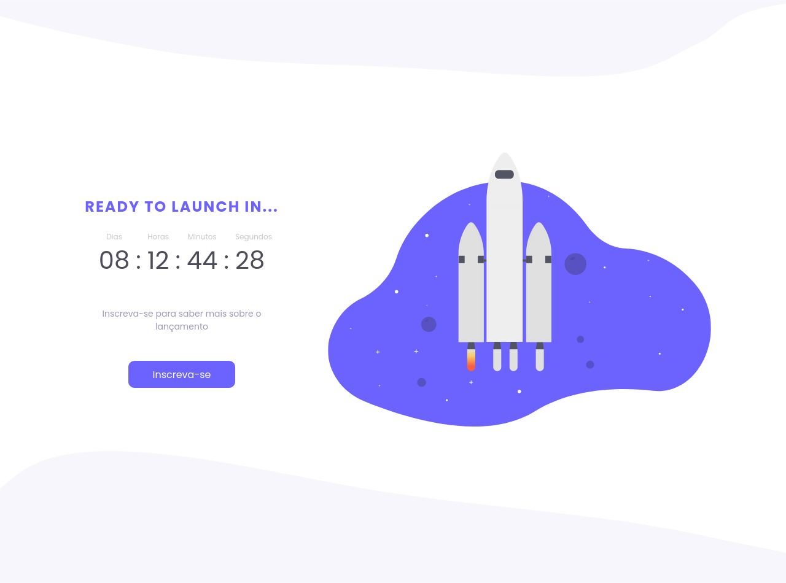
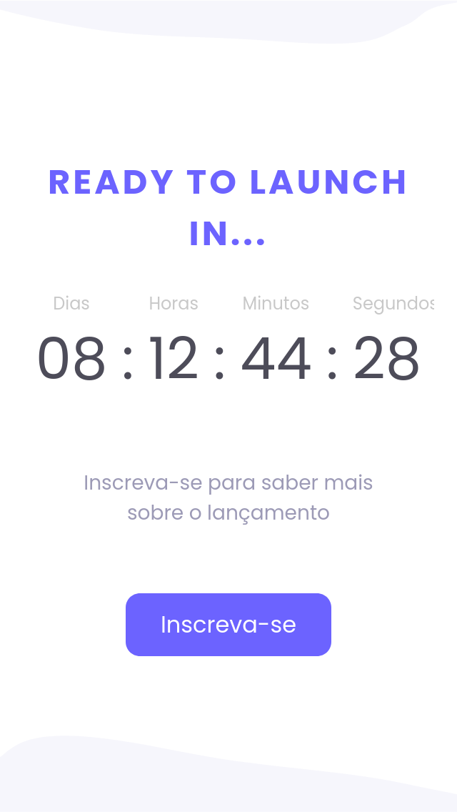

# Desafio Countdown :timer_clock:

## Sobre o projeto :information_source:

Esse projeto foi tirado de um dos desafiso do Discover, da plataforma [Rocketseat](https://app.rocketseat.com.br/discover).

Um projeto que tem como objetivo mostrar o _countdown_ em uma página sobre algum evento, etc.

Para mais detalhes sobre o projeto você pode conferir clicando [AQUI](https://app.rocketseat.com.br/discover/challenges/countdown).

---

## Tecnologias :wrench:

As tecnologias usadas foram:

- HTML
- CSS

---

## Preview :computer:

### Desktop

### Mobile

